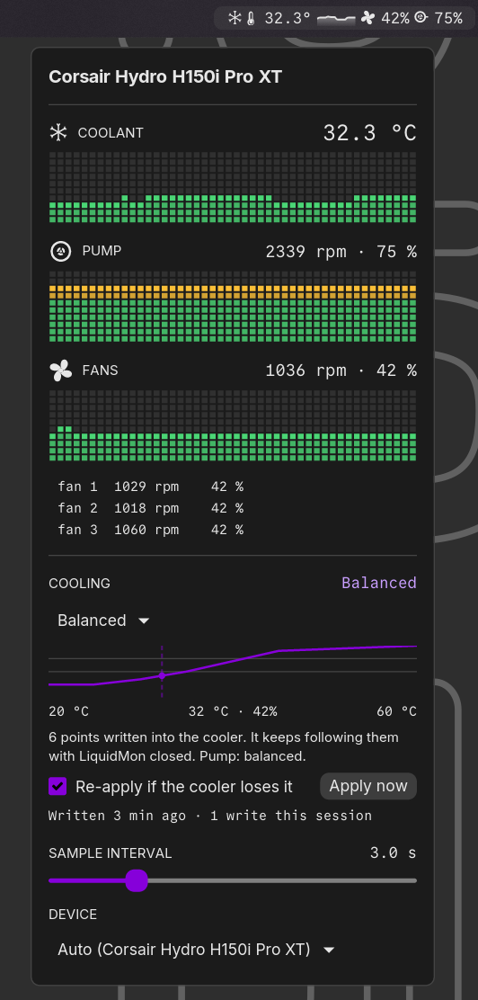

# LiquidMon

LiquidMon is a COSMIC panel applet that monitors AIO liquid coolers in
real time via the [`liquidctl`][liquidctl] CLI. The panel button shows the
current liquid temperature, a gradient-filled sparkline of recent samples,
average fan duty %, and pump duty %. Clicking it opens a popup with the
device description, three VU-meter equalizer charts (coolant temperature,
pump duty, fan-average duty) spanning up to 900 samples (~22.5 min at the
1.5 s default interval, ~15 min at the 1 s minimum), and a slider that sets
the sample interval (1.0 s – 10.0 s, persisted via cosmic-config).

The applet polls `liquidctl --json status` at the configured interval (default
1.5 s) with a 3-second per-call timeout. If a poll fails, the last successful
reading is kept on display and the popup shows the underlying error — so a
frozen temperature reading combined with an error in the popup means liquidctl
has stopped responding.



App ID: `com.github.cosmix.LiquidMon`

## Supported Devices

LiquidMon ships v1 with verified support for two AIO families:

- **Corsair Hydro Pro / Pro XT / Platinum** (e.g. H100i, H115i, H150i Pro XT, H170i)
- **Corsair iCUE Elite RGB** (e.g. H100i Elite RGB, H150i Elite RGB)

Connected liquidctl devices are enumerated on launch and when the popup is
opened. The first compatible AIO is auto-selected; a dropdown in the popup
lets you override the choice when more than one is connected. The selected
device is persisted via cosmic-config and survives applet restart.

Broader liquidctl device support (NZXT Kraken, EVGA CLC, Aquacomputer D5
Next, MSI Coreliquid, ASUS Ryujin, Lian Li Galahad II LCD) is planned —
those families ship under a separate parser change.

### Limitations

- **One device per cooler family.** When two identical AIOs are connected,
  liquidctl's substring match selects the first; v1 cannot disambiguate
  truly-identical devices.
- **Hot-plug detected on popup open.** Plugging in a new cooler does not
  auto-update the panel; open the popup once to trigger re-enumeration.

## Cooling Control

Devices in the `hydro_platinum` family — Corsair Hydro H60i/H100i/H115i/H150i
**Pro XT**, Hydro H100i/H115i **Platinum** (and **Platinum SE**), and iCUE
H100i/H115i/H150i **Elite RGB** — can be driven from the popup: four presets,
or a manual duty and pump mode. Every other connected device, including the
plain (non-XT) Hydro Pro family, stays read-only; the popup shows a caption
saying so instead of the controls.

### Presets

Each preset writes a fan curve `(liquid °C, duty %)` into the cooler along
with a pump mode:

- **Silent** — 20% at 25°C, 25% at 30°C, 35% at 35°C, 50% at 40°C, 75% at
  45°C. Pump: Quiet.
- **Balanced** — 25% at 25°C, 35% at 30°C, 50% at 35°C, 70% at 40°C, 90% at
  45°C. Pump: Balanced.
- **Performance** — 40% at 25°C, 55% at 30°C, 70% at 35°C, 85% at 40°C, 100%
  at 45°C. Pump: Extreme.
- **Max** — fans fixed at 100%, no curve. Pump: Extreme.

### Manual mode

Manual mode has one duty slider that drives every fan together (20–100%, in
steps of 5%) and a three-way pump mode: Quiet, Balanced, or Extreme.

The slider's floor is 20%, not 0%. The driver accepts lower values, but most
120/140 mm fans stall out below roughly 20% duty, and a stalled fan looks the
same as a failed one in the popup.

Pump control on this cooler family is three modes, not a percentage — the
driver has no pump-duty write, only the mode.

### Where the setting lives

Presets and manual settings are written into the cooler itself. Once applied,
the cooler keeps running that curve or duty and pump mode after LiquidMon
closes, across a logout, and across a reboot on any system whose PSU keeps
+5 V standby power alive. The setting is lost only on a full power cut (PSU
switch, unplugging, or a battery pull) — after that, LiquidMon writes it back
the same way it always does: once it notices divergence, not instantly.

### Write policy

LiquidMon never writes to the cooler on a timer, and never writes
unconditionally at startup. At most one automatic write happens per applet
run, and only after two consecutive status samples show the cooler running
something other than the saved setting. LiquidMon never passes
`--non-volatile` to liquidctl, on any device.

The default control mode is **Unmanaged**, in which LiquidMon never writes at
all — including on upgrade from an older version, which stays Unmanaged until
you pick a mode yourself. A "Re-apply if the cooler loses it" switch turns the
automatic write off entirely; with it off, the saved setting is still shown
and an "Apply now" button sends it on demand.

### Requirements

Cooling control needs the same udev / `uaccess` setup as monitoring — no root
and no privilege escalation. `/etc/udev/rules.d/71-liquidctl.rules` tags the
AIO's HID nodes `uaccess`, the same rule that already lets the applet read
status without elevated permissions. See [udev rules](#udev-rules) if the
controls render read-only on a supported model.

### Limitations

- Pump control is three modes (Quiet / Balanced / Extreme), not a duty
  percentage — the driver exposes no pump-duty write on this family.
- Applying a setting holds the liquidctl subprocess lock for roughly a
  second, so one status sample may arrive late right after a change.
- A setting written into the cooler survives a LiquidMon restart, a logout,
  and (on systems whose PSU keeps standby power alive) a reboot. It is lost
  on a full power cut, after which LiquidMon re-applies it once — two poll
  intervals after it notices, not instantly.
- If something else changes the fan duty (a manual `liquidctl` call, iCUE
  running in a VM), LiquidMon treats that as divergence and reclaims the
  setting once per run — not repeatedly, and never if the re-apply switch is
  off.
- If something else changes only the pump mode, LiquidMon can't see it:
  status reporting on this family includes pump duty and RPM but never the
  mode. Use "Apply now" to force it back.
- The tolerance used to detect a preset curve as still applied is fairly
  wide (6 percentage points). A cooler running a similar curve set by other
  software may read as already matching and be left alone — a missed
  divergence costs nothing, a false one costs an unwanted write.

## Install

### From a release (recommended)

Download the latest `.deb` from the [Releases][releases] page and install it
with `apt`, which pulls in `liquidctl` (and its HID udev rules) as a
dependency:

```sh
sudo apt install ./liquidmon_*.deb
```

If `/dev/hidraw*` nodes for the AIO already existed, replug the AIO's
internal USB header (or reboot) so they pick up the new permissions.

### From source

Install the build dependencies (matches CI):

```sh
sudo apt install \
    pkg-config \
    libxkbcommon-dev \
    libwayland-dev \
    libfontconfig1-dev \
    libfreetype6-dev \
    liquidctl
```

A stable Rust toolchain is also required ([`rustup`][rustup]).

Build and install:

```sh
cargo build --release
sudo install -Dm0755 target/release/liquidmon /usr/bin/liquidmon
sudo install -Dm0644 resources/app.desktop /usr/share/applications/com.github.cosmix.LiquidMon.desktop
sudo install -Dm0644 resources/app.metainfo.xml /usr/share/metainfo/com.github.cosmix.LiquidMon.metainfo.xml
sudo install -Dm0644 resources/icon.svg /usr/share/icons/hicolor/scalable/apps/com.github.cosmix.LiquidMon.svg
```

If you have [`just`][just], `sudo just install` runs the four `install`
commands above.

### Uninstall

```sh
sudo apt remove liquidmon          # if installed via .deb
sudo just uninstall                # if installed from source
```

## udev rules

On Debian/Ubuntu the `liquidctl` apt package ships HID udev rules to
`/lib/udev/rules.d/71-liquidctl.rules`, so installs that go through `apt`
— including the `.deb` install path above — already have them.

If liquidctl was installed another way and the applet shows `!`, install
the upstream rules manually:

```sh
sudo ./scripts/install-liquidctl-udev.sh
```

Then replug the AIO's internal USB header (or reboot) so existing
`/dev/hidraw*` nodes pick up the new permissions.

## Troubleshooting

**Panel shows `!`**

The most recent `liquidctl` call failed. Enumerate connected devices and
reproduce the underlying error from a terminal:

```sh
liquidctl list --json
liquidctl --match "<full description>" --json status
```

Common causes:

- udev rules missing — see [udev rules](#udev-rules)
- AIO unplugged or in a bad state
- `liquidctl` not installed or not on `PATH`

**Panel shows `…`**

No reading has arrived yet. Polling runs at the configured sample interval
(1.5 s by default) with a 3-second per-call timeout, so a steady `…` for
more than the interval plus 3 s means liquidctl is hanging or the
subscription failed to start. Check the COSMIC panel log:

```sh
journalctl --user -u cosmic-panel
```

**Panel reading appears frozen**

A stale reading is preserved when polls start failing. Open the popup — the
underlying error is shown at the bottom.

## Development

```sh
cargo test                # run unit tests
just check                # cargo clippy --all-features -- -W clippy::pedantic
just ci-local             # fmt --check + clippy -D warnings + test + release build
just run                  # build release and run with RUST_BACKTRACE=full
```

Vendored offline builds:

```sh
just vendor && just build-vendored
```

### Git hooks

The repo ships fast-feedback hooks in `.githooks/` that mirror CI so a
push doesn't fail after a tag is cut. Wire them into your local clone
once with:

```sh
just hooks
# or, without `just`:
./.githooks/install.sh
```

That points `core.hooksPath` at `.githooks/`, giving you:

- `pre-commit` — `cargo fmt --check` and `cargo clippy -D warnings` on
  any commit that touches `*.rs`, `Cargo.toml`, or `Cargo.lock`. Skipped
  on rebases and merges.
- `pre-push` — `cargo test --all-features` plus `cargo audit` (if
  installed) and a tag-vs-Cargo.toml version match check on tag pushes.

Optional dependency-CVE scanning needs `cargo install cargo-audit --locked`
once. Push-time bypasses if you really need them: `git push --no-verify`
or `LIQUIDMON_SKIP_AUDIT=1 git push ...` (skips just the audit step).

### Running as a standalone window

When the binary is launched outside the COSMIC panel, libcosmic falls back
to rendering the applet as a small standalone Wayland window — the panel
button becomes a clickable window, and clicking it opens the popup as an
`xdg_popup` anchored to that window. This is the fastest way to iterate
on UI changes without reinstalling into `/usr/bin` or restarting
`cosmic-panel`.

```sh
just run
# or, with a debug build:
cargo run
```

A few `COSMIC_PANEL_*` environment variables that the panel normally sets
can be set manually to influence layout — useful for testing different
panel configurations:

```sh
# Render the applet button at a larger size (XS|S|M|L|XL or Custom(N))
COSMIC_PANEL_SIZE=XL just run

# Pretend we're docked to the bottom edge (Top|Bottom|Left|Right)
COSMIC_PANEL_ANCHOR=Bottom just run
```

Requirements and caveats:

- A Wayland session is required (the COSMIC desktop or another Wayland
  compositor that supports `xdg_popup`). On X11/XWayland the popup
  positioning APIs are unavailable.
- `liquidctl` must be on `PATH` and the udev rules must be installed —
  the standalone window calls the same subprocess as the installed
  applet, so a missing rule produces the same `!` error state.
- `RUST_LOG=liquidmon=debug,cosmic=warn cargo run` raises the log level
  for the applet without flooding the terminal with libcosmic chatter.
- The standalone window has no decorations; close it with the
  compositor's window close shortcut (`Super+Q` on COSMIC) or `Ctrl+C`
  in the terminal.

## License

MPL-2.0 — see `LICENSE`.

[liquidctl]: https://github.com/liquidctl/liquidctl
[just]: https://github.com/casey/just
[rustup]: https://rustup.rs
[releases]: https://github.com/cosmix/liquidmon/releases
